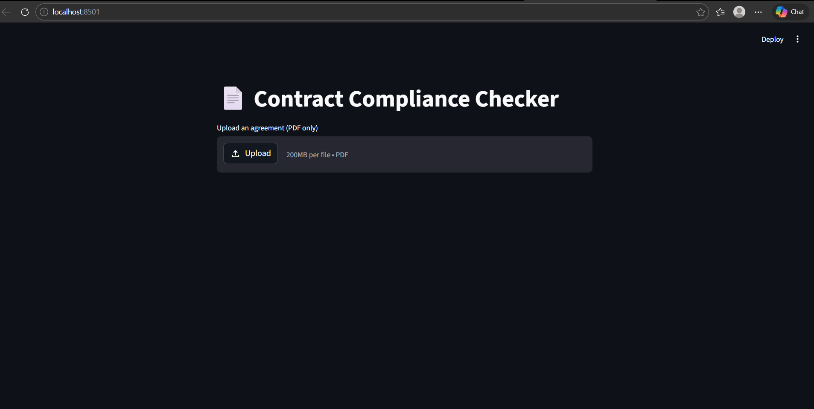
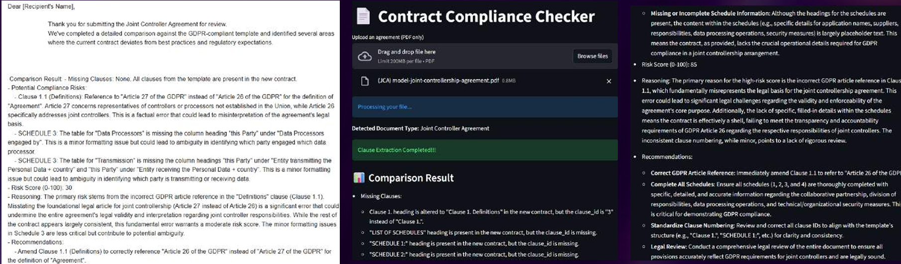

# 🚀 AI-Powered Regulatory Compliance Checker for Contract

## 📌 Overview
This project automates the analysis of legal contracts and checks compliance with regulatory standards such as GDPR using AI.

It helps identify missing clauses, risky terms, and ensures contracts meet legal requirements efficiently.

---

## ✨ Features
- 📄 Clause extraction from contracts (PDF)
- ⚖️ Compliance checking against legal templates
- 🤖 AI-powered analysis using LLMs (Gemini API)
- 📊 User-friendly Streamlit interface
- 🔔 Real-time alerts and notifications

---

## 🛠 Tech Stack
- Python
- Streamlit
- Gemini API / LLM
- JSON (legal templates)

---

## 📸 Screenshots

### 🔹 Upload Contract


### 🔹 Compliance Results


---

## ▶️ How to Run

```bash
git clone https://github.com/KhyatiSingh51/AI-Powered-Regulatory-Compliance-Checker-for-Contracts
cd AI-Powered-Regulatory-Compliance-Checker-for-Contracts
pip install -r requirements.txt
streamlit run main.py
